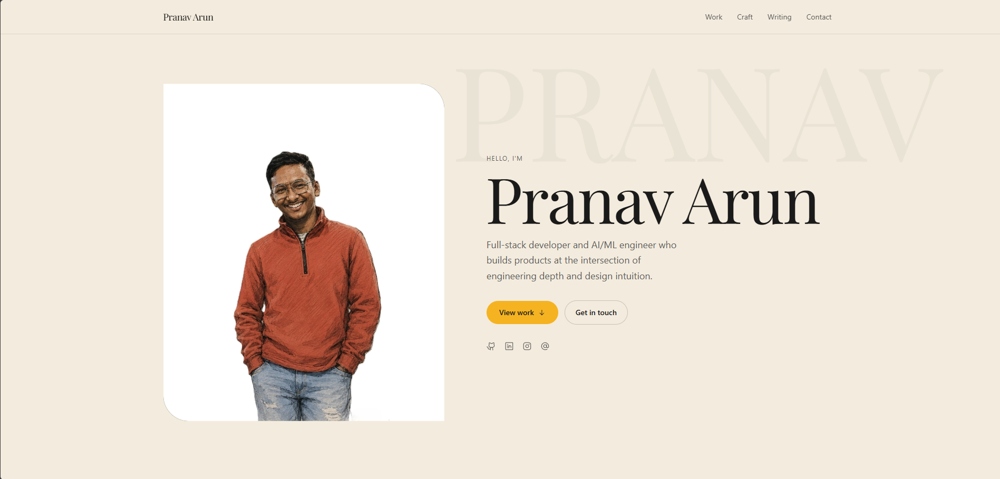

# Pranav Arun — Personal Portfolio

A modern, performance-focused personal portfolio built with **Next.js 15**, **TypeScript**, **Tailwind CSS v4**, and **Framer Motion**. Designed to showcase projects, experience, skills, and writing — with smooth animations, a clean typographic system, and a premium aesthetic.

---



---

## ✨ Features

- **Smooth scroll navigation** — hash-free, JS-powered section scrolling
- **Parallax hero** — layered scroll transforms on portrait and watermark text
- **Project showcase** — featured card + grid layout with hover transitions
- **Experience timeline** — animated timeline with linked company entries
- **Skills & AI focus** — curated skill categories with visual hierarchy
- **GitHub activity** — live contribution insights section
- **Writing section** — blog/article cards with external links
- **Contact form** — direct email integration
- **Fully responsive** — mobile-first layout with adaptive components
- **Accessible** — semantic HTML, ARIA labels, reduced-motion support

---

## 🛠️ Tech Stack

| Layer | Technology |
|---|---|
| Framework | [Next.js 15](https://nextjs.org/) (App Router, Turbopack) |
| Language | TypeScript 5 |
| Styling | Tailwind CSS v4 |
| Animations | [Motion (Framer Motion)](https://motion.dev/) |
| Icons | [@phosphor-icons/react](https://phosphoricons.com/) |
| Font | Geist (Display + Mono) |
| Package Manager | pnpm |

---

## 🚀 Getting Started

### Prerequisites

- Node.js 18+
- pnpm

### Installation

```bash
# Clone the repo
git clone https://github.com/toxicbishop/portfolio.git
cd portfolio

# Install dependencies
pnpm install

# Start the dev server
pnpm dev
```

Open [http://localhost:3000](http://localhost:3000) in your browser.

### Build for Production

```bash
pnpm build
pnpm start
```

---

## 📁 Project Structure

```
portfolio/
├── app/                  # Next.js App Router (layout, page, globals)
├── components/           # All UI sections and shared components
│   ├── nav.tsx           # Fixed navbar with smooth scroll
│   ├── hero.tsx          # Landing section with parallax
│   ├── projects.tsx      # Project cards grid
│   ├── experience.tsx    # Work experience timeline
│   ├── skills.tsx        # Skills & tools
│   ├── about.tsx         # About section
│   ├── writing.tsx       # Articles / blog
│   ├── github.tsx        # GitHub stats
│   ├── contact.tsx       # Contact form
│   ├── footer.tsx        # Footer
│   └── magnetic.tsx      # Magnetic hover effect component
├── public/               # Static assets (images, icons)
├── tailwind.config.ts    # Tailwind theme configuration
└── next.config.ts        # Next.js configuration
```

---

## 🎨 Design Tokens

The design system uses a curated palette defined in `tailwind.config.ts`:

| Token | Value | Usage |
|---|---|---|
| `cream` | `#F5F0E8` | Page background |
| `ink` | `#1A1A1A` | Primary text |
| `forest` | `#2D5016` | Accent / highlights |
| `mustard` | `#E8B84B` | CTA buttons |
| `muted` | `#8A8A7A` | Secondary text |

---

## 📄 License

This project is licensed under the terms of the [LICENSE](LICENSE) file.

---

<p align="center">Designed & built by <a href="https://github.com/toxicbishop">Pranav Arun</a></p>
